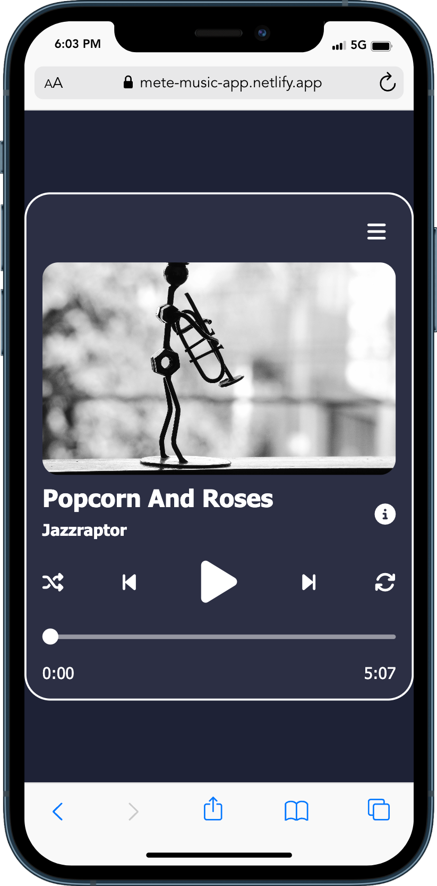
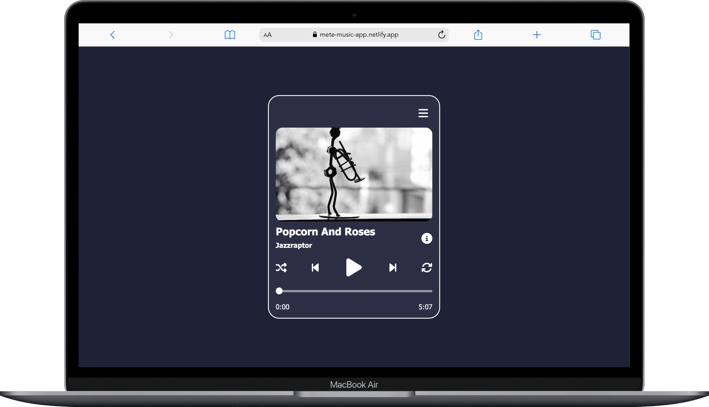

# Music Player App

Welcome to my web page project, where I've used HTML, CSS and vanilla JS to create a music player.

## Project Overview

This web application serves as a user-friendly tool to listen music. Dark/light theme of app is synchronized the dark/light theme of system preferences.

## Screenshots

Here are a couple of screenshots from my project:

  

## Technologies Used
- HTML
- Vanilla JS
- CSS

### Links
- git clone : https://github.com/Sumeyye-Mete/music-player-app.git
- live site URL : https://mete-music-app.netlify.app
